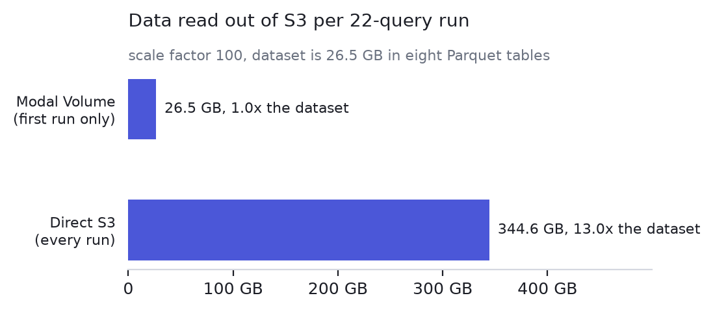
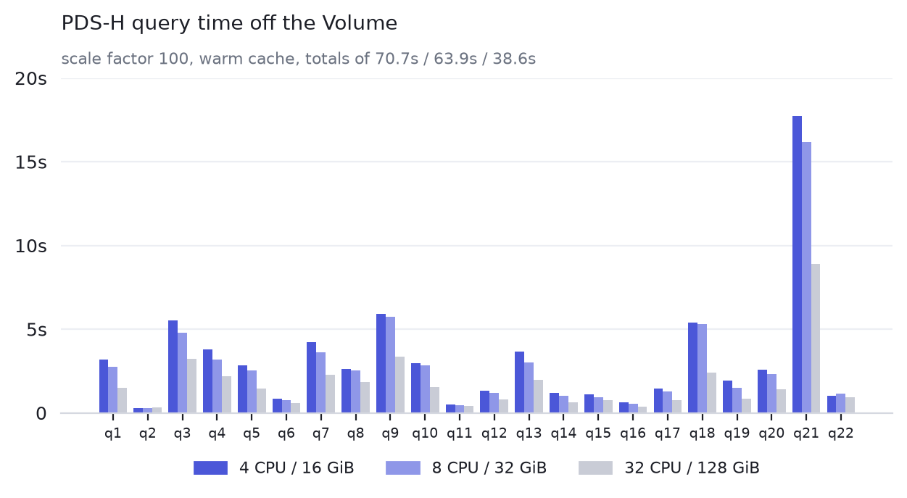

# polars-benchmark-modal

Run the [Polars PDS-H benchmark](https://github.com/pola-rs/polars-benchmark)
(a TPC-H derivative, 22 queries) on [Modal](https://modal.com), reading Parquet
from your own S3 bucket.

It measures one decision: where the queries read their input from. The same
upstream benchmark is wired three ways.

| file | input path |
|---|---|
| [`volume.py`](volume.py) | a Modal Volume, filled from S3 once (recommended) |
| [`cbm.py`](cbm.py) | a `CloudBucketMount`, on every read |
| [`s3.py`](s3.py) | `s3://` straight from Polars, on every read |

[`pdsh.py`](pdsh.py) holds the shared image, Polars settings and query runner;
[`prepare_data.py`](prepare_data.py) generates the dataset if you lack one.

## Results

Scale factor 100 (26.5 GB of Parquet, eight tables), one container, bucket in
`us-east-1`, 4 CPU / 16 GiB. Query seconds come from the upstream runner's
`timings.csv`. Dollars are [Modal](https://modal.com/pricing) and AWS list-price
arithmetic, not an invoice.

| per 22-query run | time | S3 read | Modal compute | S3 transfer | total |
|---|---:|---:|---:|---:|---:|
| Volume, first run (fills the cache) | 206s | 26.5 GB | $0.018 | $2.39 | **$2.41** |
| Volume, every run after | 175s | 0 | $0.015 | $0 | **$0.015** |
| Direct S3 | 3467s | 344.6 GB | $0.305 | $31.02 | **$31.32** |
| `CloudBucketMount` | 12951s | not measurable | $1.14 | $2.39 to $34.44, modeled | **$3.53 to $35.58** |


The S3 column is the point:



The Volume reads 26.5 GB because that is the dataset, copied once. Reading
straight from the bucket pulled 344.6 GB in the same suite, 13x the dataset,
because 17 of the 22 queries scan `lineitem` and no query keeps anything for the
next one. Storing the cached copy costs $2.22 a month, inside Modal's included
1 TiB.

Repeat the suite and the gap compounds:


| | 1 run | 10 runs |
|---|---:|---:|
| Volume | $2.41 | **$2.54** |
| Direct S3 | $31.32 | **$313.20** |
| `CloudBucketMount` | $3.53 to $35.58 | **$35.30 to $355.80** |

Speed follows the same order. All three suites finished every query; the
geometric mean per query is 2.10s off the Volume, 55.45s off `s3://` and 182.17s
off the mount:


Off the warm Volume, by container size:



Scaling is sublinear. Eight times the cores buys 1.8x on the 22-query total
(70.7s to 38.6s) at 4.6x the price, so the small container is the sensible
default.

Volume and direct-S3 bytes are measured, one as a file copy and the other from
the container's own network counters. The mount's are not, because those
counters stay near zero while it streams, so its transfer is a range from one
pass over the dataset to no reuse at all. Count it from the bucket side
instead (CloudWatch `BytesDownloaded`).

Dollars use $0.09/GB internet egress, $0.0000131 per core-second and
$0.00000222 per GiB-second, unpinned so no region multiplier. Substitute your
own egress rate and the shape holds.

One container per run, not a cluster, landing wherever Modal had capacity
rather than next to the bucket. Repeats varied 10% to 20% in wall time, so
treat small differences as noise.

Regenerate the charts with
`pip install -e '.[charts]' && python docs/make_charts.py` or
`uv sync --extra charts && uv run python docs/make_charts.py`.

## Keeping the cache fresh

The cache does not assume the bucket stands still. Every run lists the prefix and
compares each object's size and last-modified time against a manifest kept beside
the cached files, then copies what is new or changed and deletes what is gone. An
unchanged dataset costs one listing and no transfer.

The unit of re-fetch is one file, since S3 objects are immutable and there is no
way to fetch only the rows that changed inside one. So a table held as a single
Parquet file is recopied whole even for a one-row edit. Partition the tables you
expect to update, which upstream supports: set `NUM_BATCHES=<n>` and lay them out
as `scale-<scale>/<n>/<table>/<batch>/part.parquet`. The cache mirrors whatever
tree is under the prefix, so a rewritten partition costs one file, not a table.

## Setup

```bash
# in this repo
git clone https://github.com/pola-rs/polars-benchmark   # the benchmark itself
pip install modal && modal setup            # or: uv pip install modal && modal setup

export S3_BUCKET=your-bucket
export S3_ROLE_ARN=arn:aws:iam::...:role/your-role      # optional, see below
```

With `S3_ROLE_ARN` set, the container exchanges its own
[Modal OIDC identity](https://modal.com/docs/guide/cloud-bucket-mounts) for
short-lived credentials, so no long-lived AWS keys are involved. Without it,
create a Modal Secret named `aws-secret` holding `AWS_ACCESS_KEY_ID` and
`AWS_SECRET_ACCESS_KEY`.

Also optional: `S3_PREFIX` (default `pdsh`), `S3_REGION` (default `us-east-1`),
`POLARS_BENCHMARK_REPO` (default `./polars-benchmark`), and `CACHE_VOLUME_NAME` /
`RESULTS_VOLUME_NAME` / `SEED_VOLUME_NAME` if the default Volume names collide.

## Usage

```bash
# Once, if you need the data: writes <prefix>/scale-<scale>/<table>.parquet for
# volume.py and cbm.py, and upstream's network layout,
# <prefix>/scale-factor-<scale>/1/<table>/*.parquet, for s3.py.
modal run prepare_data.py --scale 100.0

# All 22 queries. The first run fills the Volume, later runs hit the cache.
modal run volume.py

# A subset, and the same queries off the other input paths.
modal run volume.py --queries 1,6
modal run cbm.py --queries 1
modal run s3.py --queries 1
```

Every run prints JSON per resource configuration: wall time, per-query seconds
from `timings.csv`, failed queries, and the S3 bytes it moved, which for
`volume.py` is the files the cache refresh copied and is empty when nothing
changed.

Each entry point sweeps `CONFIGS` in `pdsh.py`, one container per entry. Modal
bills the CPU and memory a function requests whether or not it uses them, so run
the sweep before settling on a size.

## Notes

- Upstream `pola-rs/polars-benchmark` is used unmodified. This repo supplies the
  container, the cache and the resource sizing. Per its README, results are not
  comparable to published TPC-H figures.
- `RUN_INCLUDE_IO=1` is set, so query timings include reading the Parquet, which
  is the whole point of comparing input paths.
- A `CloudBucketMount` is [built on Mountpoint for S3](https://modal.com/docs/guide/cloud-bucket-mounts),
  whose content cache Modal states is
  [not preserved across Function executions](https://github.com/modal-labs/modal-client/issues/1839),
  so a later run or another worker re-reads from the bucket. A Volume is durable
  and shared, which is why it is the recommended path.
- Runs are single-container. Polars' distributed engine spreads the same queries
  over many workers, where the cache matters more: each worker would otherwise
  re-read from S3 independently.

## License

Apache 2.0. See [`LICENSE`](LICENSE).
