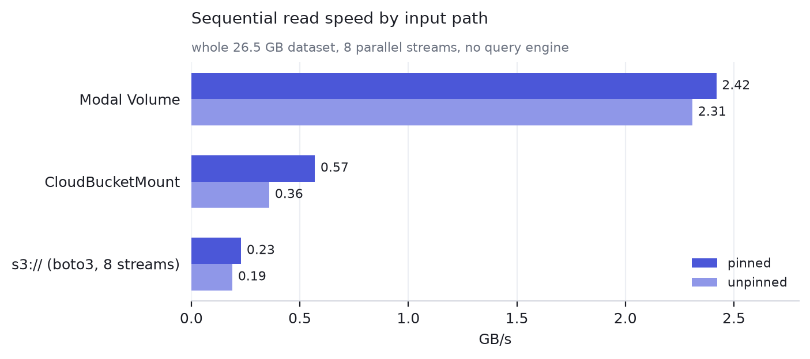
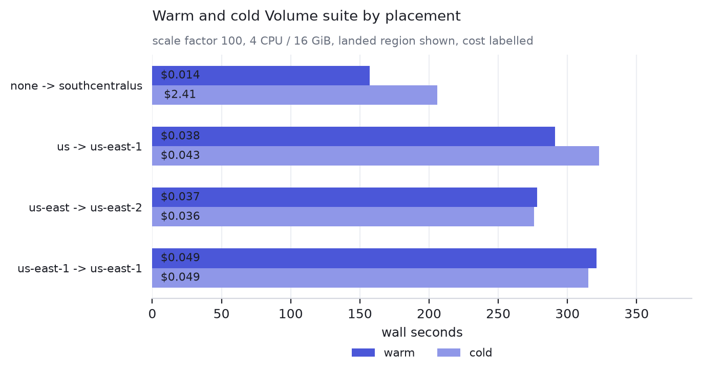
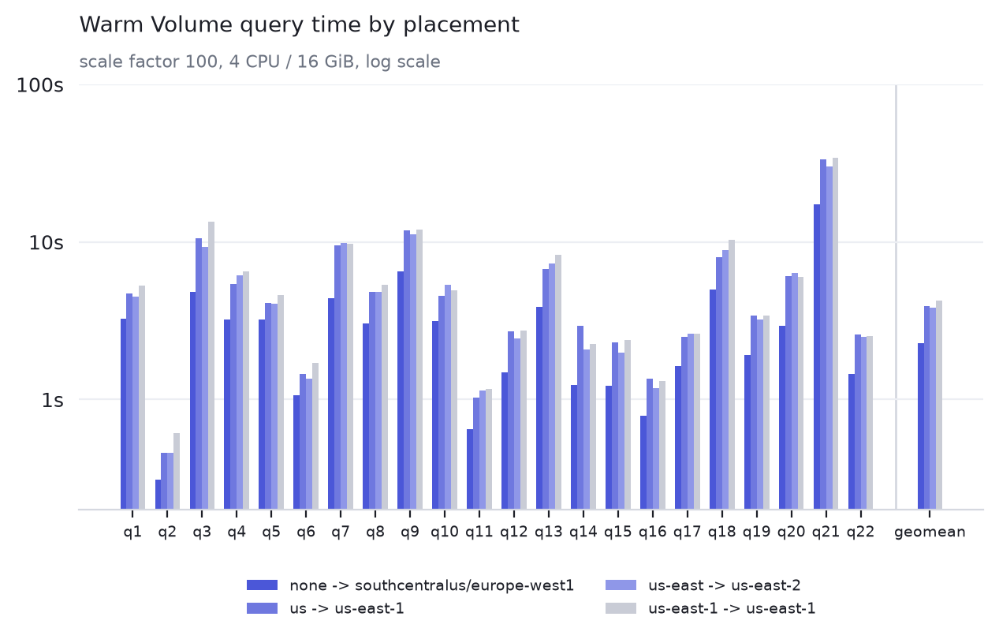
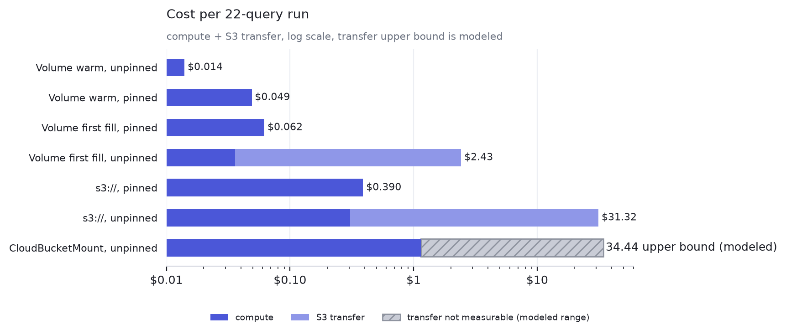
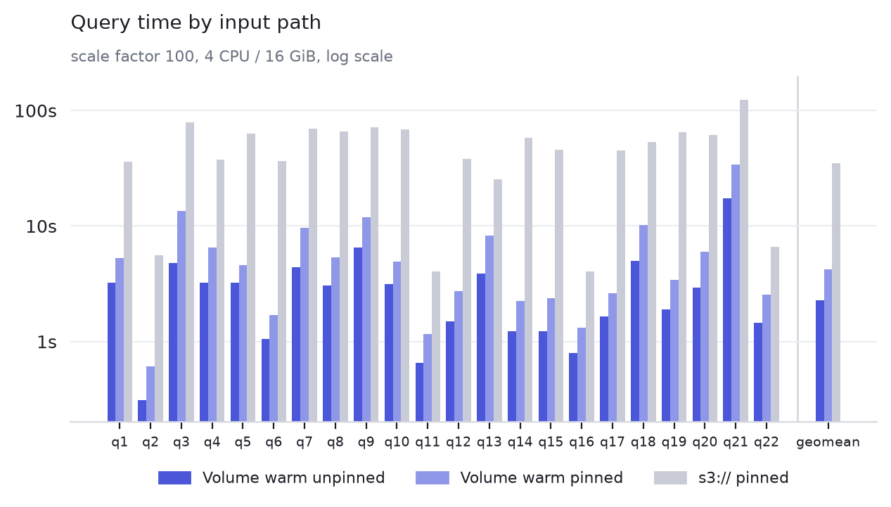
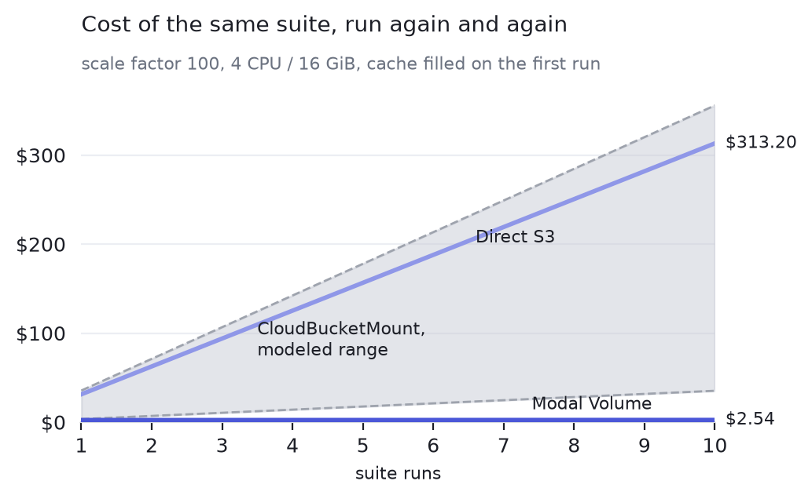

# polars-benchmark-modal

Run the [Polars PDS-H benchmark](https://github.com/pola-rs/polars-benchmark)
(a TPC-H derivative, 22 queries) on [Modal](https://modal.com), reading Parquet
from your own S3 bucket.

It measures one decision: where the queries read their input from, and where the
container reading it runs. The same upstream benchmark is wired three ways.

| file | input path |
|---|---|
| [`volume.py`](volume.py) | a Modal Volume, refreshed from the bucket, then read locally |
| [`cbm.py`](cbm.py) | a `CloudBucketMount` over the bucket, on every read |
| [`s3.py`](s3.py) | `s3://` straight from Polars, on every read |
| [`mixed.py`](mixed.py) | static tables from a Volume, one fresh table from the bucket |

[`pdsh.py`](pdsh.py) holds the shared image, Polars settings and query runner;
[`prepare_data.py`](prepare_data.py) generates the dataset if you lack one.

## Transfer cost is a placement question

Modal automatically uses an
[S3 Gateway endpoint](https://modal.com/docs/guide/s3-gateway-endpoints) when a
container runs on AWS, so a container reading a bucket in its own AWS region
pays no transfer charge. A container in a different region pays inter-region
rates, and a container on another cloud pays the bucket's internet egress rate.
Unpinned containers land wherever there is capacity, so both cases are ordinary.

Placement is a knob with a compute multiplier. Broad selectors currently cost
1.5x and exact region selectors 1.75x, but only the landed region decides
whether a bucket read is in-region and free of transfer charges. Read speed is
the thing an input path actually changes, so the benchmark measures both.

## Results

Scale factor 100 (26.5 GB of Parquet, eight tables), one container, 4 CPU /
16 GiB, bucket in `us-east-1`. Query seconds come from the upstream runner's
`timings.csv`. Dollars are [Modal](https://modal.com/pricing) and AWS list-price
arithmetic, not an invoice.

Reading the whole dataset once, eight parallel streams, no query engine
involved:



| read speed | pinned to `us-east-1` | unpinned |
|---|---:|---:|
| Modal Volume | 2.42 GB/s | 2.31 GB/s |
| `CloudBucketMount` | 0.57 GB/s | 0.36 GB/s |
| `s3://` | 0.23 GB/s | 0.19 GB/s |

The Volume is roughly 10x the mount and 4x Polars' own S3 reader, and it is the
one path whose speed does not depend on where the container landed.

### Placement comparison



| input path | requested region | landed region | compute multiplier | suite wall | per-query geomean | read GB/s | cost |
|---|---|---|---:|---:|---:|---:|---:|
| Volume, warm | none | southcentralus | 1.0x | 157s | 2.28s | 2.42 | $0.014 |
| Volume, warm | `us` | us-east-1 | 1.5x | 291s | 3.92s | 2.87 | $0.038 |
| Volume, warm | `us-east` | us-east-2 | 1.5x | 278s | 3.83s | 2.55 | $0.037 |
| Volume, warm | `us-east-1` | us-east-1 | 1.75x | 321s | 4.23s | 2.37 | $0.049 |
| `s3://` | `us-east` | us-east-1 | 1.5x | 1933s | 31.02s | 0.208 | $0.255 |
| `s3://` | `us-east-1` | us-east-1 | 1.75x | 1956s | 31.76s | 0.197 | $0.301 |

The broad selector reached the bucket's region for `s3://` at 1.5x, versus
1.75x for the exact selector, and took 1933s versus 1956s. That difference is
within the observed run-to-run spread, so it is not evidence that broad is
faster. Broad selectors are not a guarantee: `us-east` landed in `us-east-2`
for the warm Volume run and in `us-east-1` for the cold fill. The former is
inter-region traffic against this `us-east-1` bucket and can incur transfer
charges. The landed region, not the requested selector, decides whether the
read is free.

Cold Volume fills add one 26.5 GB ingest:

| requested region | landed region | compute multiplier | suite wall | ingest | per-query geomean | cost |
|---|---|---:|---:|---:|---:|---:|
| none | southcentralus | 1.0x | 206s | not reported | not reported | $2.41 total |
| `us` | us-east-1 | 1.5x | 323s | 82.8s at 0.320 GB/s | 4.14s | $0.043 |
| `us-east` | us-east-1 | 1.5x | 276s | 83.0s at 0.319 GB/s | 3.90s | $0.036 |
| `us-east-1` | us-east-1 | 1.75x | 315s | 84.5s at 0.314 GB/s | 4.31s | $0.049 |

In-region ingest ran at essentially the same speed across broad and exact
selectors. The 276s to 323s cold-suite range is within the run-to-run spread,
so the durable cold-run difference is the compute multiplier. The unpinned cold
fill includes modeled off-region transfer. Cold-fill read speed is omitted
because the probe measured the container's page cache.



All four placements track each other closely, within roughly 10% to 25% per
query, with no reordering of expensive queries. Placement changes the price of
the run rather than its performance profile, and q21 dominates every placement.

The 22-query suite, with what it cost:

| per 22-query run | time | S3 read | compute | transfer | total |
|---|---:|---:|---:|---:|---:|
| Volume, warm, unpinned | 157s | 0 | $0.014 | $0 | **$0.014** |
| Volume, warm, pinned | 321s | 0 | $0.049 | $0 | **$0.049** |
| Volume, first fill, pinned | 84s + 315s | 26.5 GB | $0.062 | $0 | **$0.062** |
| Volume, first fill, unpinned | 253s + 157s | 26.5 GB | $0.036 | $2.39 | **$2.43** |
| `s3://`, pinned | 1956s | 351.3 GB | $0.301 | $0 | **$0.301** |
| `s3://`, unpinned | 3467s | 344.6 GB | $0.305 | $31.01 | **$31.32** |
| `CloudBucketMount`, unpinned | 12951s | not measurable | $1.14 | modeled | - |



Two separate effects are visible there. Placement decides the transfer column:
$31.01 becomes $0 for the same 22 queries. The input path decides the time
column: 1956s reading `s3://` in-region against 157s off a warm Volume, a
geometric mean of 31.76s against 2.28s per query.



So the cheapest arrangement measured here is neither of the two obvious ones. It
fills the cache from a pinned container, where the one-time copy is free, and
runs the queries unpinned off the Volume, where compute is cheapest and no
transfer happens at all:

| SF100, 10 suite runs a month | cost |
|---|---:|
| pinned fill once, then unpinned Volume runs | **$0.15** plus $2.22 storage |
| pinned `s3://`, no cache | **$3.01** |
| unpinned `s3://`, no cache | **$313.20** |



### Two things that are easy to get wrong

Pinning is not only the price multiplier. The same warm-Volume suite took 157s
unpinned and 314s, 321s and 353s across three pinned runs, slower on all 22
queries rather than a few, so pinned capacity in one region is a narrower and
not necessarily faster pool. Measure your own workload before pinning a fleet.

The mount is erratic rather than uniformly slow. Its raw read speed is 1.5x to
3x Polars' S3 reader, but q1 took 123s unpinned and 629s pinned, and the full
suite took 12951s unpinned. A pinned full suite was preempted before finishing,
so there is no pinned suite number here.

How to read these numbers:

- Volume and direct-S3 bytes are measured, one as a file copy and the other from
  the container's own network counters. The mount's are not, because those
  counters stay near zero while it streams. Count those from the bucket side
  instead (CloudWatch `BytesDownloaded`).
- Dollars use $0.0000131 per core-second, $0.00000222 per GiB-second, a 1.75x
  multiplier on pinned rows, $0.09/GiB-month of Volume storage, and $0.09/GB
  internet egress on rows where the container was off-region. Substitute your own
  egress rate and the shape holds.
- Read speed is a sequential pass over every Parquet file with eight parallel
  streams, so it measures the path under a small container, not a network
  ceiling.
- One container per run, not a cluster. Repeats varied 10% to 20% in wall time,
  so treat small differences as noise.

Regenerate the charts with
`pip install -e '.[charts]' && python docs/make_charts.py` or
`uv sync --extra charts && uv run python docs/make_charts.py`.

## Choosing an input path

Cache when the same bytes are read more than once. For `Q` queries over a
dataset of `D` GB, where each query reads a fraction `f` of it, at `e` per GB of
transfer and `c` per second of compute:

- read from the bucket every time: `Q * (t_bucket * c + f * D * e)`
- fill a Volume once, then read from it: `D * e + t_fill * c + Q * (t_volume * c)`
  plus storage

Pinning sets `e` to zero and raises `c`. Reuse is what pays for the fill and the
storage. At SF100 above, the fill costs $0.06 and each suite saves $0.287
against pinned `s3://`, so the copy pays for itself on the first run and the
$2.22 of monthly storage pays for itself after about eight.

Cache poorly when each object is read once. A job over the last few minutes of
trading data, or yesterday's prices, reads a window that was never in the cache
and will not be queried again, so a copy just adds a hop. Time-partitioning does
not change that: the newest partition is always cold.

Mixed workloads split, and this is where the once-only case is worth measuring
rather than assuming. [`mixed.py`](mixed.py) caches the static tables and treats
`lineitem`, 18 GB of the 26.5 GB, as a batch that has never been read: q3 joins
two cached tables against it, 4 CPU / 16 GiB.

| fresh table, static tables on a Volume | requested region | fresh transfer | q3 |
|---|---|---:|---:|
| staged into the Volume, then queried | `us-east-1` | 41s for 18 GB | 9.5s |
| read from the mount on every scan | `us-east-1` | none up front | 687s |
| staged into the Volume, then queried | none | 82s for 18 GB | 9.6s |
| read from the mount on every scan | none | none up front | 206s |

Staging data that is read once still won, by more than the copy cost, in region
and out of it. A query does not read an object once: it goes back to it, and each
round trip pays the mount's request latency, while the copy pays it once and the
query then runs at Volume speed. The mount rows are the erratic path noted above,
so read them as hundreds of seconds rather than as exact figures.

## Keeping the cache fresh

The cache does not assume the bucket stands still. Every run lists the prefix and
compares each object's size and last-modified time against a manifest kept beside
the cached files, then copies what is new or changed and deletes what is gone. An
unchanged dataset costs one listing and no transfer.

The unit of re-fetch is one file, since S3 objects are immutable and there is no
way to fetch only the rows that changed inside one. So a table held as a single
Parquet file is recopied whole even for a one-row edit. Partition the tables you
expect to update, which upstream supports: set `NUM_BATCHES=<n>` and lay them out
as `scale-<scale>/<n>/<table>/<batch>/part.parquet`. The cache mirrors whatever
tree is under the prefix, so a rewritten partition costs one file, not a table.

## Setup

```bash
# in this repo
git clone https://github.com/pola-rs/polars-benchmark   # the benchmark itself
pip install modal && modal setup            # or: uv pip install modal && modal setup

export S3_BUCKET=your-bucket
export S3_ROLE_ARN=arn:aws:iam::...:role/your-role      # optional, see below
```

With `S3_ROLE_ARN` set, the container exchanges its own
[Modal OIDC identity](https://modal.com/docs/guide/cloud-bucket-mounts) for
short-lived credentials, so no long-lived AWS keys are involved. Without it,
create a Modal Secret named `aws-secret` holding `AWS_ACCESS_KEY_ID` and
`AWS_SECRET_ACCESS_KEY`.

To place containers next to the bucket, set `PIN_CLOUD` and `PIN_REGION`:

```bash
export PIN_CLOUD=aws PIN_REGION=us-east   # or PIN_REGION=us-east-1, see below
```

Modal's public [region options](https://modal.com/docs/guide/region-selection)
stop at `us-east`, which covers `us-east-1` and `us-east-2`, so a bucket in
`us-east-1` can still be read across regions. Exact regions such as `us-east-1`
need granular access, which Modal grants on request.

Also optional: `S3_PREFIX` (default `pdsh`), `S3_REGION` (default `us-east-1`),
`POLARS_BENCHMARK_REPO` (default `./polars-benchmark`), and `CACHE_VOLUME_NAME` /
`RESULTS_VOLUME_NAME` / `SEED_VOLUME_NAME` if the default Volume names collide.

## Usage

```bash
# Once, if you need the data: writes <prefix>/scale-<scale>/<table>.parquet for
# volume.py and cbm.py, and upstream's network layout,
# <prefix>/scale-factor-<scale>/1/<table>/*.parquet, for s3.py.
modal run prepare_data.py --scale 100.0

# All 22 queries. The first run fills the Volume, later runs hit the cache.
modal run volume.py

# A subset, and the same queries off the other input paths.
modal run volume.py --queries 1,6
modal run cbm.py --queries 1
modal run s3.py --queries 1

# Static tables cached, one fresh table read from the bucket on every scan.
modal run mixed.py --queries 3 --mode direct
```

Every run prints JSON per resource configuration: wall time, per-query seconds
from `timings.csv`, failed queries, the read speed of its input path, and the S3
bytes it moved, which for `volume.py` is the files the cache refresh copied and
is empty when nothing changed.

Each entry point sweeps `CONFIGS` in `pdsh.py`, one container per entry. Modal
bills the CPU and memory a function requests whether or not it uses them, so run
the sweep before settling on a size.

## Notes

- Upstream `pola-rs/polars-benchmark` is used unmodified. This repo supplies the
  container, the cache and the resource sizing. Per its README, results are not
  comparable to published TPC-H figures.
- `RUN_INCLUDE_IO=1` is set, so query timings include reading the Parquet, which
  is the whole point of comparing input paths.
- A `CloudBucketMount` is [built on Mountpoint for S3](https://modal.com/docs/guide/cloud-bucket-mounts),
  whose content cache Modal states is
  [not preserved across Function executions](https://github.com/modal-labs/modal-client/issues/1839),
  so a later run or another worker re-reads from the bucket. A Volume is durable
  and shared across workers.
- Runs are single-container. Polars' distributed engine spreads the same queries
  over many workers, where the input path matters more: each worker otherwise
  reads from the bucket independently, and worker-to-worker traffic over
  [i6pn](https://modal.com/docs/guide/i6pn) is same-region, so a distributed run
  is pinned in practice.

## License

Apache 2.0. See [`LICENSE`](LICENSE).
